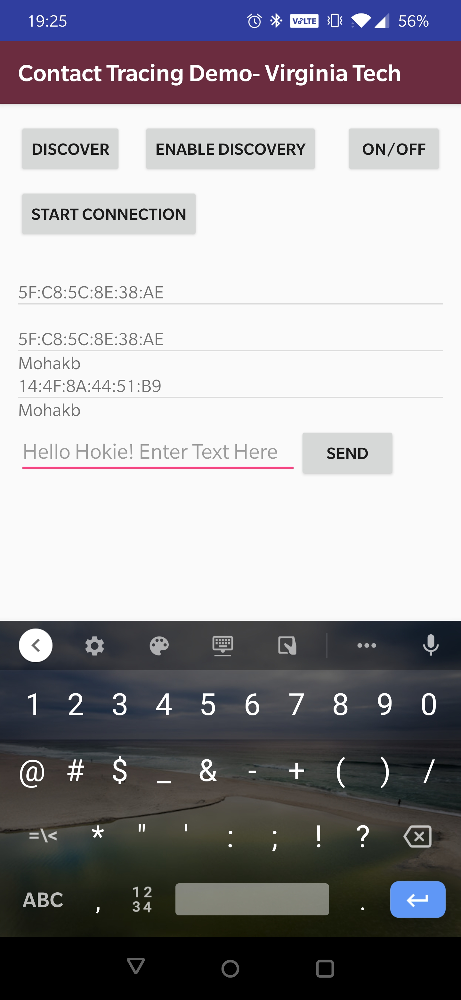

Android Chat App Demo
===
Simple Bluetooth Android app for handling device discovery, pairing and recording timestamps for messages. 

 

Introduction
---
The app was build as a demo to exchange data between two smartphones using Bluetooth communication. The main parts of the Bluetooth connectivity include scanning for available bluetooth devices, establishing RFCOMM channel between the devices, similar to TCP, enabling connection to other devices through service discovery, and finally transferring data in the form of text/image back and forth. Module BluetoothConnectionService includes the above functionalities, from pairing and connection to transferring data. On the other hand, the UI for the app is developed in modules deviceAdapter and MainActivity. 

Required Tools
---
1. Android Studio IDE and SDK
2. Two Android devices

Note: The UI for the app is developed for a 6-inch smartphone. However, you can change the debug configuration on Android Studio to use it for a device with a different type/screen size.

Setup
---
1. Clone this repo and open it inside of Android Studio. Any SDK version above 24 should work fine. Gradle version : 3.6.3.          Refer local.properties inside the gradle build on Android Studio. 
2. Build the app on Android Studio. 
3. Install the app to the USB connected Android phone. Ideally, you will need to install special drivers and enable wireless USB debugging on your phone for this to work (if there is more than one smartphone). 
4. Run this application on the phone with Bluetooth turned ON. Enable discovery on the application,and pair with the desired device with 'Start Connection'. The MAC address of the paired device will now be visible. Timestamps of messages sent and received will be visibe in the log section of Android Studio. 
